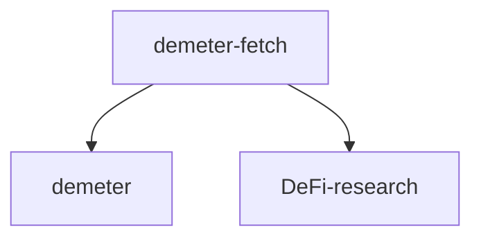
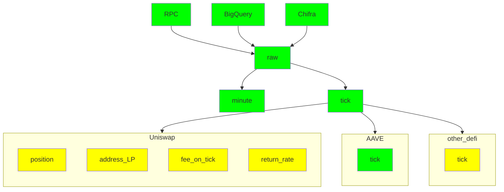
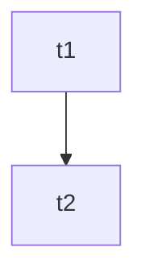

# README

## 1. Introduction

dDemeter-fetch is a member of the demeter family, which is responsible for fetching and processing on-chain data. It provides standardized data for backtesting and defi studies.



Demeter-fetch can fetch chain event logs of DEFI projects from various sources and convert them into a unified format. In the project dimension, it supports Uniswap and AAVE. In the data source dimension, the supported data sources include:

* rpc: Standard RPC interface of evm chains.
* Google BigQuery: BigQuery is a fully managed enterprise data warehouse that helps you manage and analyze your data with built-in features like machine learning, crypto coin analysis, and business intelligence. BigQuery's serverless architecture lets you use SQL queries to answer your organization's biggest questions with zero infrastructure management. 
* chifra: This is an on-chain data indexing tool from Trueblocks. It can scrape and reorganize on-chain data, and export them in various formats. 

Demeter-fetch supports export formats such as

* Uniswap:
	* minutely OHLC: Open, high, low, close of data (price, liquidity etc.) in a minute interval.
	* tick: formatted transaction of uniswap
	* positions(TODO): transaction data for position dimension
	* LP of address(TODO): transactions of liquidity providers 
	* fee on tick(TODO): How many fees can be collected per minute for each tick. 
	* return rate(TODO): Return rate of positions
* AAVE:
	* minutely OHLC
	* tick 

The minutely OHLC is mainly used in Demeter, while tick data can be transformed into many forms of data.

The system uses streaming processing, first summarizing all the channels into raw files, and then processing them into various data. The processing flow is shown in the figure. Green is finished, while yellow is to do.


	

Demeter-fetch system can fetch uniswap pool/proxy event log data from RPC/BigQuery/TrueBlocks Chifra according to user needs, and it save downloaded data to **Raw Data**, then user can generate **Tick Data** or **1Min Resample Data**, They can be used in **Demeter** back trade system and data analyze on **LP about position**, user investment behavior etc.

Also can convert local raw file to tick/minute/position data for Demeter or other data analyze work.

Demeter-fetch support download from the following source:

* RPC: query data from rpc interface of any Ethereum like chain node, but it may be slow.
* Google BigQuery: just support Ethereum and Polygon, and will cost a little dollar according to the query, but will fetch faster than rpc.
* TureBlocks Chifra: just support Ethereum data index, some contract with big index will cost some time to make the index file.

Usually, query a pool logs of a day form BigQuery will cost 10 seconds, while query from node will cause several minutes. One day time cost can get from benchmark section, and **BigQuery** is most recommend. Your should make a choice on download speed and download cost.

Demeter-fetch support export data in following type:

* raw: Original event log. [sample](sample%2Fpolygon-0x45dda9cb7c25131df268515131f647d726f50608-2022-01-05.raw.csv)
* minute: process uniswap data and resample it to minute, [sample](sample%2Fpolygon-0x45dda9cb7c25131df268515131f647d726f50608-2022-01-05.minute.csv). Demeter use data in this type. 
* tick: process uniswap data, each log will be decoded and listed. [sample](sample%2Fpolygon-0x45dda9cb7c25131df268515131f647d726f50608-2022-01-05.tick.csv)

The detail of field for the file can be found in section 4.

### 1.1 Workflow



## 2 How to use

### 2.1 Prepare big query

To use bigquery, you should prepare account and environment.

1. Sign up a google account. and then access [google cloud](https://console.cloud.google.com) to register google cloud platform.
2. Apply an api key, and install library. follow the tutorial on [official document site](https://cloud.google.com/bigquery/docs/reference/libraries)
3. Try query here: https://console.cloud.google.com/bigquery. Chain data is public, no extra authority is needed.

In BigQuery, you can query chain data with correct id and table name. the query interface is compatible sql. You can try with this sql

```sql
select * from bigquery-public-data.crypto_ethereum.blocks where timestamp="2015-07-30 15:26:28"
```

> note: If you have network issues on Google, set proper proxy before download data.

### 2.2 Prepare RPC

To use node, you can get sign up a data provider account like infura, quicknode, alchemy. or setup your node to short the request delay. If you have trouble on connection, demeter also provide proxy configuration.

### 2.3 Prepare Chifra

You should install as doc [TrueBlock install](https://trueblocks.io/docs/install/install-core/)  
Remember it only support Linux and Mac system.  
And if you have trouble, you can find result at [install troubleshooting](https://trueblocks.io/docs/install/install-troubleshooting/)

### 2.3 Install

demeter-fetch is not available on Pypi, you need to clone this repo, and run locally. then install dependency.

### 2.4 Download

Create a target folder to store downloaded files, then prepare a config.toml file according to [config-sample.toml](config-sample.toml)
* from.uniswap/from.aave from which dapp get event log
* from.big_query/from.rpc/from.file/from.chifra data source configure

then execute:

```shell
cd demeter-fetch
python main.py config.toml

```

More samples are here: [samples](docs/samples.md)

## 3 Benchmark

|               | one day data cost(seconds) | recommended | reason                                          |
|---------------|----------------------------|-------------|-------------------------------------------------|
| rpc           | 575s                       | ☆☆          | cost too much time to get data from rpc service |
| bigquery      | 9s                         | ☆☆☆☆☆       | very fast and only cost about 0.05 usd/day data |
| file          | 1s                         | ☆☆☆         | just convert downloaded raw data                |
| chifra local  | 6s                         | ☆☆          | just merge local downloaded eth data            |
| chifra export | 61s                        | ☆☆☆         | export chifra data and only support ethereum    |


## 4 File format

The downloaded data is grouped by date, that is, one file per day. 

The format of the file name is "[chain name]-[Pool/token contract address]-[date].[file type].csv". e.g. polygon-0x45dda9cb7c25131df268515131f647d726f50608-2022-01-05.minute.csv

To prevent download failure, demeter-fetch will download all files first, then convert raw files to minute/tick files. So after the download is completed, the target folder will save two kinds of files, .raw.csv and .minute.csv/.tick.csv.


* Raw file is original transaction event log, one row for an event log, [sample](sample%2Fpolygon-0x45dda9cb7c25131df268515131f647d726f50608-2022-01-05.raw.csv).
* Minute file is used in demeter. In this file, event logs are abstracted to market data, such as price, total liquidity, apy etc. For the convenience of backtesting, data is resampled minutely. [sample](sample%2Fpolygon-0x45dda9cb7c25131df268515131f647d726f50608-2022-01-05.minute.csv). 
* Like minute file, in tick file, event logs are also abstracted to market data, but data will not be resampled. so one row for an event log. Some transaction information such as block number and transaction hash is also kept. It is often used for market analysis. [sample](sample%2Fpolygon-0x45dda9cb7c25131df268515131f647d726f50608-2022-01-05.tick.csv)

### 4.1 Raw Data
#### Raw Data definition

| field                | definition                                                                         |
|----------------------|------------------------------------------------------------------------------------|
| **block_number**     | log in the block, and data will be sorted by block number ascending                |
| **block_timestamp**  | the timestamp to mine block, will be used to show sorted date                      |
| **transaction_hash** | record transaction hash and log index to remove duplicated log                     |
| **pool_tx_index**    | transaction index to separate transaction data                                     |
| **pool_log_index**   | log index to remove duplicated data                                                |
| **pool_topics**      | swap/mint/burn/collect/decrease_liquidity/increase_liquidity keccak and other data |
| **pool_data**        | log value in the data field                                                        |
| **proxy_topics**     | nftmanager contract log topics                                                     |
| **proxy_data**       | nftmanager log value in the data field                                             |

* block_number, block_timestamp, log_index used to sort raw data.  
* transaction_hash and log_index to remove duplicated log data.
* topics and data provide core data to analysis.

#### Raw sample csv data
| block_number | block_timestamp | transaction_hash | pool_tx_index | pool_log_index | pool_topics                                                                                                                                                                                                                                                                                                                                                                                                                                                                                                                                                                                                                                                                                                                                                                                                                                        | pool_data | proxy_topics | proxy_data | proxy_log_index |
|---|---|---|---|---|----------------------------------------------------------------------------------------------------------------------------------------------------------------------------------------------------------------------------------------------------------------------------------------------------------------------------------------------------------------------------------------------------------------------------------------------------------------------------------------------------------------------------------------------------------------------------------------------------------------------------------------------------------------------------------------------------------------------------------------------------------------------------------------------------------------------------------------------------|---|---|---|---|
| 23353830 | 2022-01-05 00:00:02+00:00 | 0xa47dbaeb8275a6a6e6f5cda339c3b982e71415a2947d1cbe4b4d0723c02137f6 | 0 | 3 | "['0xc42079f94a6350d7e6235f29174924f928cc2ac818eb64fed8004e115fbcca67', '0x000000000000000000000000e592427a0aece92de3edee1f18e0157c05861564', '0x0000000000000000000000008b26320912935111300ddaeec15ea9a182ff6f1a']"                                                                                                                                                                                                                                                                                                                                                                                                                                                                                                                                                                                                                               | 0xffffffffffffffffffffffffffffffffffffffffffffffffffffffff4de3bba60000000000000000000000000000000000000000000000000af2c6b8a5ec76800000000000000000000000000000000000003f74862e71484308ef7bb48a1738000000000000000000000000000000000000000000000000180180212f8e71b6000000000000000000000000000000000000000000000000000000000002f57f | [] |  | |
| 23353834 | 2022-01-05 00:00:18+00:00 | 0x7566ec0d48f21e53c84fd267bf87443e094f5cacfe240690cae1a3bf0aaf2529 | 1 | 5 | "['0xc42079f94a6350d7e6235f29174924f928cc2ac818eb64fed8004e115fbcca67', '0x000000000000000000000000e592427a0aece92de3edee1f18e0157c05861564', '0x000000000000000000000000693fb96fdda3c382fde7f43a622209c3dd028b98']"                                                                                                                                                                                                                                                                                                                                                                                                                                                                                                                                                                                                                               | 0xfffffffffffffffffffffffffffffffffffffffffffffffffffffffe82d041e0000000000000000000000000000000000000000000000000176f04cdd60157000000000000000000000000000000000000003f75b6ca5fbbd6df2cce1d68e000000000000000000000000000000000000000000000000000136df9c71fb56a29000000000000000000000000000000000000000000000000000000000002f581 | [] |  | |
| 51214980 | 2023-12-17 00:05:11+00:00 | 0x9199209a3aa7c33e74595b381d2c3a46820368d3336731e9160583eede5b1397 | 2 | 9 | "['0x70935338e69775456a85ddef226c395fb668b63fa0115f5f20610b388e6ca9c0', '0x000000000000000000000000c36442b4a4522e871399cd717abdd847ab11fe88', '0x0000000000000000000000000000000000000000000000000000000000030a3e', '0x0000000000000000000000000000000000000000000000000000000000030a48']" | 0x00000000000000000000000087d1ed6f4d3865079851d6a02fe5d59f7d4d4ce7000000000000000000000000000000000000000000000000000000012f5ca585000000000000000000000000000000000000000000000000000587ef1f740eaa | "['0x40d0efd1a53d60ecbf40971b9daf7dc90178c3aadc7aab1765632738fa8b8f01', '0x000000000000000000000000000000000000000000000000000000000012abfb']" | 0x00000000000000000000000087d1ed6f4d3865079851d6a02fe5d59f7d4d4ce7000000000000000000000000000000000000000000000000000000012f5ca585000000000000000000000000000000000000000000000000000587ef1f740eaa | 10 |

### 4.2 Tick Data

#### Tick Data definition
| field               | definition                           |
|---------------------|--------------------------------------|
| **block_number** | same as raw data                     |
| **block_timestamp**                | same as raw data                     |
| **tx_type**                | operation type, SWAP/MINT/BURN/COLLECT |
| **transaction_hash**                | same as raw data                     |
| **pool_tx_index**                | same as raw data                     |
| **pool_log_index**                | same as raw data                     |
| **proxy_log_index**                | same as raw data                     |
| **sender**                | topic sender data                    |
| **receipt**                | topic receipt data                   |
| **amount0**                | token0 exchange amount               |
| **amount1**                | token1 exchange amount               |
| **total_liquidity**                | calc total liquidity from swap data  |
| **total_liquidity_delta**                | log liquidity change data            |
| **sqrtPriceX96**                | sqrtx96 price                        |
| **current_tick**                | swap operation at current tick       |
| **position_id**                | nf token id                          |
| **tick_lower**                | position lower tick                  |
| **tick_upper**                | position upper tick                  |
| **liquidity**                | curent log liquidity data            |

* total_liquidity: swap liquidity data.
* total_liquidity_delta: mint/burn liquidity exchange abs value.

#### Raw sample csv data
| block_number | block_timestamp | tx_type | transaction_hash | pool_tx_index | pool_log_index | proxy_log_index | sender | receipt | amount0 | amount1 | total_liquidity | total_liquidity_delta | sqrtPriceX96 | current_tick | position_id | tick_lower | tick_upper | liquidity |
| --- | --- | --- | --- | --- | --- | --- | --- | --- | --- | --- | --- | --- | --- | --- | --- | --- | --- | --- |
| 23353830 | 2022-01-05 00:00:02 | SWAP | 0xa47dbaeb8275a6a6e6f5cda339c3b982e71415a2947d1cbe4b4d0723c02137f6 | 0 | 3 |  | 0xe592427a0aece92de3edee1f18e0157c05861564 | 0x8b26320912935111300ddaeec15ea9a182ff6f1a | -2988196954 | 788911381103277696 | 1729804611907121590 | 0 | 1287023799018574070893171027089208 | 193919.0 |  |  |  |  |
| 23353928 | 2022-01-05 00:06:24 | BURN | 0xe6f83a25910ec9945e829e24158e795977f4af6b70abae5a05932e9d7e450734 | 56 | 241 | 242.0 | 0xc36442b4a4522e871399cd717abdd847ab11fe88 |  | 0 | 8028675937866099451 | 1370269449887500119 | 0 | 1289037848681739736056052571218067 | 193951.0 | 13283.0 | 193890.0 | 193920.0 | 329754919099238285 |
| 23353928 | 2022-01-05 00:06:24 | COLLECT | 0xe6f83a25910ec9945e829e24158e795977f4af6b70abae5a05932e9d7e450734 | 56 | 245 | 246.0 | 0xc36442b4a4522e871399cd717abdd847ab11fe88 | 0xb020852796bb04e431e6a2f018805c142fbd4a03 | 869413 | 8031239514820639447 | 1370269449887500119 | 0 | 1289037848681739736056052571218067 | 193951.0 | 13283.0 | 193890.0 | 193920.0 |  |
| 23354033 | 2022-01-05 00:09:59 | MINT | 0x19c7d8a662009b5a14b7a0630f07b86ec8bdd663d34a4f674e3ebe5b33ba244b | 31 | 144 | 146.0 | 0xc36442b4a4522e871399cd717abdd847ab11fe88 |  | 16738133293 | 2892535954003525198 | 1455262468155384164 | 60134336564964532 | 1288911018771896468642711393513864 | 193949.0 | 13285.0 | 193890.0 | 194040.0 | 60134336564964532 |

### 4.3 1Min Resample Data

#### 1Min Resample Data definition
| field               | definition                            |
|---------------------|---------------------------------------|
| **timestamp** | timestamp use to sort data            |
| **netAmount0**                | token0 net value                      |
| **netAmount1**                | token1 net value                      |
| **closeTick**                | close tick in 1min                    |
| **openTick**                | open tick in 1min                     |
| **lowestTick**                | lowest tick in 1min                   |
| **highestTick**                | highest tick in 1min                  |
| **inAmount0**                | token0 amount exchange value          |
| **inAmount1**                | token1 amount exchange value          |
| **currentLiquidity**                | swap data get current total liquidity |

### 1Min Resample sample csv data
| timestamp | netAmount0 | netAmount1 | closeTick | openTick | lowestTick | highestTick | inAmount0 | inAmount1 | currentLiquidity |
| --- | --- | --- | --- | --- | --- | --- | --- | --- | --- |
| 2022-01-05 00:00:00 | -9383445114 | 2477485048495721856 | 193921 | 193919 | 193919 | 193921 | 0 | 2477485048495721856 | 1400049692807883305 |
| 2022-01-05 00:01:00 | -35317761550 | 9329849855269298153 | 193929 | 193921 | 193921 | 193929 | 704261153 | 9515626276489030515 | 1400049692807883305 |
| 2022-01-05 00:02:00 | -55692411213 | 14727627582768166668 | 193942 | 193937 | 193937 | 193942 | 499743350 | 14859678472128538245 | 1395128131590419632 |


## 5 project structure

```text
.
├── LICENSE
├── README.md
├── auth
│   └── google_bigquery_auth.json
├── config-sample.toml            sample config
├── demeter_fetch
│   ├── __init__.py
│   ├── _typing.py                typing defination
│   ├── aave_downloader.py
│   ├── constants.py              constants
│   ├── general_downloader.py     general download code
│   ├── processor_aave
│   │   ├── __init__.py
│   │   ├── aave_utils.py
│   │   ├── minute.py
│   │   └── tick.py
│   ├── processor_uniswap         downloaded raw file to uniswap tick/minute file
│   │   ├── __init__.py
│   │   ├── minute.py
│   │   ├── tick.py
│   │   └── uniswap_utils.py
│   ├── source_big_query          fetch data from bigquery
│   │   ├── __init__.py
│   │   ├── aave.py
│   │   ├── big_query_utils.py
│   │   └── uniswap.py
│   ├── source_chifra             fetch data from chifra
│   │   ├── __init__.py
│   │   ├── chifra_utils.py
│   │   └── uniswap.py
│   ├── source_file               deal with exist raw file
│   │   ├── __init__.py
│   │   └── common.py
│   ├── source_rpc                fetch data from rpc
│   │   ├── __init__.py
│   │   ├── aave.py
│   │   ├── eth_rpc_client.py
│   │   └── uniswap.py
│   ├── uniswap_downloader.py      uniswap downloader main logic
│   └── utils.py                   utility
├── main.py                        project enter point
├── release_note.md
├── requirements.txt               project dependence
├── sample                         sample data
├── tests                          testcase 
└── workflow.png
```

## 6 Release note

You can find it [here](docs/release_note.md)

## 7 Roadmap

* Support more chain data download.
* Improve download speed and reduce download cost.
* Add more data output, LP position data etc.
* Support pypi install and Sphinx doc on readthedoc.io.