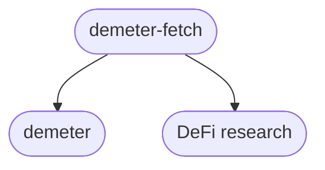
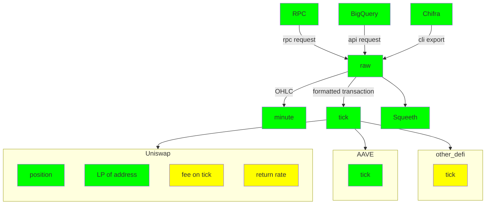

# README

## 1. Introduction

dDemeter-fetch is a member of the demeter family, which is responsible for fetching and processing on-chain data. It provides standardized data for backtesting and defi research.

Demeter-fetch can fetch chain event logs of DEFI projects from various sources and convert them into a unified format. In the project dimension, it supports Uniswap and AAVE. In the data source dimension, the supported data sources include:

* [RPC](https://ethereum.org/en/developers/docs/apis/json-rpc/): Standard RPC interface of evm chains.
* [Google BigQuery](https://goo.gl/oY5BCQ): A fully managed enterprise that allows you to query on-chain data with SQL queries. 
* [Trueblocks Chifra](https://trueblocks.io/): This is an on-chain data indexing tool from Trueblocks, which scrape and reorganize on-chain data, and export them in various formats. 

Demeter-fetch supports export formats such as:

* **Uniswap**:
	* ✔️ **minutely OHLC**: Open, high, low, close of data (price, liquidity etc.) in a minute interval.
	* ✔️ **tick**: formatted transaction of uniswap
	* ✔️ **positions(TODO)**: transaction data for position dimension
	* ✔️ **LP of address(TODO)**: transactions of liquidity providers 
	* 🔴 **fee on tick(TODO)**: How many fees can be collected per minute for each tick. 
	* 🔴 **return rate(TODO)**: Return rate of positions
* **AAVE**:
	* ✔️ **minutely OHLC**
	* ✔️ **tick** 
* **Squeeth**:
	* ✔️ **minutely data**

The minutely OHLC is mainly used in Demeter, while tick data is used in research, where being transformed into many forms.

Demeter-fetch uses streaming processing. It will summarize all the channels into raw files first, and then transform them into various forms. The processing flow is shown in the figure, in which green blocks are finished, and yellow blocks are to-do.

## 2 design rationale
1. **not node not your data**. Demeter fetch does not directly provide data, you need config your data source. 
2. **config,run, done!** use it without knowledge like event log, solidity,ethereum. Keep it simple.
3. **customized data output**. from tick to address net value. Do your own research with various data.

## 3 Use cases:
**[chaoslab research](https://chaoslabs.xyz/resources/chaos_uniswap_v3_lp_simulation_platform_case_study.pdf)**:
At this juncture, we retrieve all on-chain swaps for the selected pool over a span of 180 days,
enabling us to replay them during the backtesting phase. This data retrieval is facilitated
via Google BigQuery, which is employed by Demeter intrinsically.
We extend our gratitude to the Demeter team for the creation and open-sourcing of this
valuable library to the wider Uniswap community.

**[zelos research](https://medium.com/zelos-research/2023-market-sentiment-and-lp-behavior-on-uniswap-d737816cf1f1)** It is our own research. Demeter fetch have us won first prize in Bounty #20 of [UGPCA](https://uniswap.notion.site/Bounty-20-Optimism-Liquidity-Mining-program-546d123fa03049fba4b0b8cd38781117)

## 4 Roadmap

* Support more DEFI projects.
* Add more statistics for uniswap.

## 5 Links

* [Quick Start](docs/quickstart.md)
* [FAQ](docs/faq.md)
* [Samples](docs/samples.md)
* [data Specifcation](docs/specifation.md)
* [Release note](docs/release_note.md)
* [Project structure](docs/structure.md)

* [Demeter](https://github.com/zelos-alpha/demeter)
* [Medium](https://medium.com/zelos-research)

