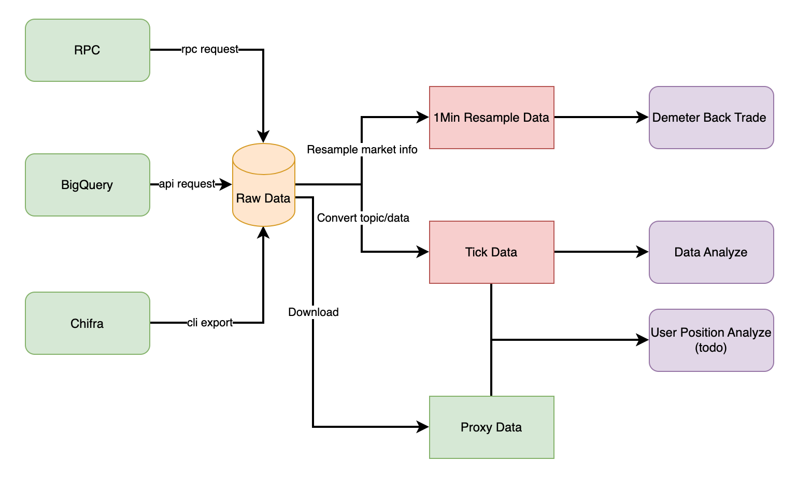

# README

## 1 What's this:

Demeter-fetch system can fetch uniswap pool/proxy event log data from RPC/BigQuery/TrueBlocks Chifra according to user needs, and it save downloaded data to **Raw Data**, then user can generate **Tick Data** or **1Min Resample Data**, They can be used in **Demeter** back trade system and data analyze on LP about position, user investment behavior etc.

Also can convert local raw file to tick/minute data for Demeter or other data analyze work.

Demeter-fetch support download from the following source:

* RPC: query data from rpc interface of any Ethereum like chain node.
* Google BigQuery: just support Ethereum and Polygon, and cost a little dollar, but will fetch faster than rpc.
* TureBlocks Chifra: just support Ethereum data index.

Usually, query a pool logs of a day form BigQuery will cost 10 seconds. while query from node will cause several minutes.

One day time cost can get from benchmark section, and **BigQuery** is most recommend.

Demeter-fetch support export data in following type:

* raw: Original event log. [sample](sample%2Fpolygon-0x45dda9cb7c25131df268515131f647d726f50608-2022-01-05.raw.csv)
* minute: process uniswap data and resample it to minute, [sample](sample%2Fpolygon-0x45dda9cb7c25131df268515131f647d726f50608-2022-01-05.minute.csv). Demeter use data in this type. 
* tick: process uniswap data, each log will be decoded and listed. [sample](sample%2Fpolygon-0x45dda9cb7c25131df268515131f647d726f50608-2022-01-05.tick.csv)

The detail of field for the file can be found in section 4.

### 1.1 Workflow


## 2 How to use

### 2.1 Prepare big query

To use bigquery, you should prepare account and environment.

1. Sign up a google account. and then access [google cloud](https://console.cloud.google.com) to register google cloud platform.
2. Apply an api key, and install library. follow the tutorial on [official document site](https://cloud.google.com/bigquery/docs/reference/libraries)
3. Try query here: https://console.cloud.google.com/bigquery. Chain data is public, no extra authority is needed.

In BigQuery, you can query chain data with correct id and table name. the query interface is compatible sql. You can try with this sql

```sql
select * from bigquery-public-data.crypto_ethereum.blocks where timestamp="2015-07-30 15:26:28"
```

> note: If you have network issues on Google, set proper proxy before download data.

### 2.2 Prepare RPC

To use node, you can get sign up a data provider account like infura, quicknode, alchemy. or setup your node to short the request delay. If you have trouble on connection, demeter also provide proxy configuration.

### 2.3 Prepare Chifra

You should install as doc [TrueBlock install](https://trueblocks.io/docs/install/install-core/)  
Remember it only support Linux and Mac system.  
And if you have trouble, you can find result at [install troubleshooting](https://trueblocks.io/docs/install/install-troubleshooting/)

### 2.3 Install

demeter-fetch is not available on Pypi, you need to clone this repo, and run locally. then install dependency.

### 2.4 Download

Create a target folder to store downloaded files, then prepare a config.toml file according to [config-sample.toml](config-sample.toml)

then execute:

```shell
cd demeter-fetch
python main.py config.toml

```

### 2.5 Examples

#### ethereum chifra(local) download
config_chifra_local.toml with local pool csv file and proxy csv file
```toml
[from]
chain = "ethereum"
datasource = "chifra"
dapp_type = "uniswap"

[from.uniswap]
pool_address = "0x88e6a0c2ddd26feeb64f039a2c41296fcb3f5640"

[from.chifra]
file_path = "./sample/0x88e6a0c2ddd26feeb64f039a2c41296fcb3f5640_2023-11-10.raw.csv"
ignore_position_id = false # Just for uniswap, if set to true, will not download uniswap proxy logs to get position_id. will save a lot of time
proxy_file_path = "./sample/0xc36442b4a4522e871399cd717abdd847ab11fe88_2023-11-10.raw.csv" # Just for uniswap, only required when ignore_position_id=False

[to]
type = "tick"
save_path = "./sample"
multi_process = false
skip_existed = true
```
run script:
```shell
python main.py config_chifra_local.toml
```
result:
```
2023-11-20 22:14:58 Download config: {
    "from_config": {
        "chain": "ethereum",
        "data_source": "chifra",
        "dapp_type": "uniswap",
        "uniswap_config": {
            "pool_address": "0x88e6a0c2ddd26feeb64f039a2c41296fcb3f5640"
        },
        "aave_config": null,
        "big_query": null,
        "chifra_config": {
            "file_path": "./sample/0x88e6a0c2ddd26feeb64f039a2c41296fcb3f5640_2023-11-10.raw.csv",
            "ignore_position_id": false,
            "proxy_file_path": "./sample/0xc36442b4a4522e871399cd717abdd847ab11fe88_2023-11-10.raw.csv",
            "start": null,
            "end": null,
            "etherscan_api_key": null
        },
        "rpc": null,
        "file": null,
        "http_proxy": null
    },
    "to_config": {
        "type": "tick",
        "save_path": "./sample",
        "multi_process": false,
        "skip_existed": true,
        "to_file_list": {}
    }
}
2023-11-20 22:14:58 Will generate 0 files
2023-11-20 22:14:58 Skip existed files, 0 files is exist, now will generate 0 files
2023-11-20 22:14:58 Loading csv file
2023-11-20 22:14:58 Process files
2023-11-20 22:14:59 Pool logs has downloaded, now will convert proxy logs
2023-11-20 22:14:59 loading proxy file
2023-11-20 22:14:59 Matching proxy log to pool logs, this may take a while
100%|███████████████████████████████████████████████████████████████████████████████████████████████████████████████████| 1/1 [00:04<00:00,  4.19s/it]
2023-11-20 22:15:04 Start to save files
2023-11-20 22:15:04 Saving daily files
100%|███████████████████████████████████████████████████████████████████████████████████████████████████████████████████| 1/1 [00:00<00:00,  2.17it/s]
  0%|                                                                                             | 0/1 [00:00<?, ?it/s]

2023-11-20 22:15:04 Download finish
2023-11-20 22:15:04 Start generate 1 files
100%|█████████████████████████████████████████████████████████████████████████████████████| 1/1 [00:08<00:00,  8.17s/it]
```

#### ethereum chifra(export) download
config_chifra_export.toml with local pool csv file and proxy csv file
```toml
[from]
chain = "ethereum"
datasource = "chifra"
dapp_type = "uniswap"
http_proxy = "http://127.0.0.1:7890"  # if cannot connect etherscan.io

[from.uniswap]
pool_address = "0x88e6a0c2ddd26feeb64f039a2c41296fcb3f5640"

[from.chifra]
file_path = "./sample"
ignore_position_id = false
proxy_file_path = "./sample"
start = "2023-11-15"
end = "2023-11-15"
etherscan_api_key = "your_api_key" # must set

[to]
type = "tick"
save_path = "./sample"
multi_process = false
skip_existed = true
```

run script and result:
```text
python main.py config_chifra_export.toml 
  0%|                                                                                             | 0/1 [00:00<?, ?it/s]2023-11-30 14:30:28 Download config: {
    "from_config": {
        "chain": "ethereum",
        "data_source": "chifra",
        "dapp_type": "uniswap",
        "uniswap_config": {
            "pool_address": "0x88e6a0c2ddd26feeb64f039a2c41296fcb3f5640"
        },
        "aave_config": null,
        "big_query": null,
        "chifra_config": {
            "file_path": "/sample",
            "ignore_position_id": false,
            "proxy_file_path": "/sample",
            "start": "2023-11-15",
            "end": "2023-11-15",
            "etherscan_api_key": "your_api_key"
        },
        "rpc": null,
        "file": null,
        "http_proxy": "http://127.0.0.1:7890"
    },
    "to_config": {
        "type": "tick",
        "save_path": "/sample",
        "multi_process": false,
        "skip_existed": true,
        "to_file_list": {}
    }
}
2023-11-30 14:30:28 Will generate 1 files
2023-11-30 14:30:28 Skip existed files, 0 files is exist, now will generate 1 files
2023-11-30 14:30:41 fetch start_height: 18573579, end_height: 18580726
PROG[26-12|14:31:03.240] [..................................................]  0%  4784/ 6847521 0x88e6a0c2ddd26feeb64f039a2c41296fcb3f5640
100%|█████████████████████████████████████████████████████████████████████████████████████| 1/1 [00:36<00:00, 36.11s/it]
  0%|                                                                                             | 0/1 [00:00<?, ?it/s]2023-11-30 14:31:15 fetch start_height: 18573579, end_height: 18580726
PROG[26-12|14:31:26.838] [..................................................]  0%  2665/ 2239034 0xc36442b4a4522e871399cd717abdd847ab11fe88
2023-11-30 14:31:28 Loading csv file
100%|█████████████████████████████████████████████████████████████████████████████████████| 1/1 [00:23<00:00, 23.23s/it]
2023-11-30 14:31:28 Process files
2023-11-30 14:31:28 Pool logs has downloaded, now will convert proxy logs
2023-11-30 14:31:28 loading proxy file
2023-11-30 14:31:28 Matching proxy log to pool logs, this may take a while
100%|███████████████████████████████████████████████████████████████████████████████████████████████████████████████████| 1/1 [00:00<00:00,  1.58it/s]
2023-11-30 14:31:29 Start to save files
2023-11-30 14:31:29 Saving daily files


2023-11-30 14:31:29 Download finish
2023-11-30 14:31:29 Start generate 1 files
100%|███████████████████████████████████████████████████████████████████████████████████████████████████████████████████| 1/1 [00:00<00:00, 10.47it/s]
100%|█████████████████████████████████████████████████████████████████████████████████████| 1/1 [00:01<00:00,  1.84s/it]
```

#### polygon rpc download
config_rpc.toml
```toml
[from]
chain = "polygon"
datasource = "rpc"
dapp_type = "uniswap"

[from.uniswap]
pool_address = "0x9B08288C3Be4F62bbf8d1C20Ac9C5e6f9467d8B7"

[from.rpc]
end_point = "https://polygon-mainnet.infura.io/v3/your_api_key"
start = "2023-11-20"
end = "2023-11-20"
ignore_position_id = false

[to]
type = "tick"
save_path = "./sample"
multi_process = false
```

run script and get result:
```text
python main.py config_rpc.toml 
2023-11-30 22:43:34 Download config: {
    "from_config": {
        "chain": "polygon",
        "data_source": "rpc",
        "dapp_type": "uniswap",
        "uniswap_config": {
            "pool_address": "0x9b08288c3be4f62bbf8d1c20ac9c5e6f9467d8b7"
        },
        "aave_config": null,
        "big_query": null,
        "chifra_config": null,
        "rpc": {
            "end_point": "https://polygon-mainnet.infura.io/v3/your_api_key",
            "start": "2023-11-20",
            "end": "2023-11-20",
            "batch_size": 500,
            "auth_string": null,
            "keep_tmp_files": null,
            "ignore_position_id": false,
            "etherscan_api_key": null
        },
        "file": null,
        "http_proxy": null
    },
    "to_config": {
        "type": "tick",
        "save_path": "./sample-data",
        "multi_process": false,
        "skip_existed": false,
        "to_file_list": {}
    }
}
2023-11-30 22:43:34 Will generate 1 files
Download from 2023-11-20 to 2023-11-20
2023-11-30 22:43:35 Querying end timestamp, wait for 8 seconds to prevent max rate limit
2023-11-30 22:43:44 Will download from height 50151408 to 50191552
2023-11-30 22:43:44 Can not find a height cache, will generate one
100%|█████████████████████████████████████████████████████████████████████████████| 40145/40145 [08:01<00:00, 83.36it/s]
2023-11-30 22:51:46 Save block timestamp cache to ./sample-data/polygon_height_timestamp.pkl, length: 10660
2023-11-30 22:51:46 generate daily files
2023-11-30 22:51:46 Pool logs has downloaded, now will download proxy logs
2023-11-30 22:51:46 Height cache has loaded, length: 10660
100%|████████████████████████████████████████████████████████████████████████████| 40145/40145 [01:18<00:00, 510.79it/s]
2023-11-30 22:53:05 Save block timestamp cache to ./sample-data/polygon_height_timestamp.pkl, length: 10660
2023-11-30 22:53:05 start merge pool and proxy files
100%|█████████████████████████████████████████████████████████████████████████████████████| 1/1 [00:03<00:00,  3.95s/it]


2023-11-30 22:53:09 Download finish
2023-11-30 22:53:09 Start generate 1 files
100%|█████████████████████████████████████████████████████████████████████████████████████| 1/1 [00:06<00:00,  6.54s/it]
```

#### polygon bigquery download
config_bigquery.toml
```toml
[from]
chain = "polygon"
datasource = "rpc"
dapp_type = "uniswap"
http_proxy = "http://127.0.0.1:7890" # set proxy if cannot connect google service

[from.uniswap]
pool_address = "0x45dda9cb7c25131df268515131f647d726f50608"

[from.big_query]
start = "2023-11-25"
end = "2023-11-25"
auth_file = "your_google_auth_json" # google bigquery auth file

[to]
type = "tick"
save_path = "./sample"
multi_process = false
```
run script and get result:
```text
python main.py config_bigquery.toml 
2023-11-30 23:06:14 Download config: {
    "from_config": {
        "chain": "polygon",
        "data_source": "big_query",
        "dapp_type": "uniswap",
        "uniswap_config": {
            "pool_address": "0x45dda9cb7c25131df268515131f647d726f50608"
        },
        "aave_config": null,
        "big_query": {
            "start": "2023-11-25",
            "end": "2023-11-25",
            "auth_file": "your google auth json"
        },
        "chifra_config": null,
        "rpc": null,
        "file": null,
        "http_proxy": "http://127.0.0.1:7890"
    },
    "to_config": {
        "type": "tick",
        "save_path": "./sample",
        "multi_process": false,
        "skip_existed": false,
        "to_file_list": {}
    }
}
2023-11-30 23:06:14 Will generate 1 files
100%|█████████████████████████████████████████████████████████████████████████████████████| 1/1 [00:08<00:00,  8.68s/it]


2023-11-30 23:06:23 Download finish
2023-11-30 23:06:23 Start generate 1 files
100%|█████████████████████████████████████████████████████████████████████████████████████| 1/1 [00:02<00:00,  2.18s/it]
```

#### convert raw file to tick/minute resample file
config_convert.toml
```toml
[from]
chain = "polygon"
datasource = "file"
dapp_type = "uniswap"

[from.uniswap]
pool_address = "0x45dda9cb7c25131df268515131f647d726f50608"

[from.file]
files = [
    "./sample/polygon-0x45dda9cb7c25131df268515131f647d726f50608-2023-11-25.raw.csv"
]
[to]
type = "minute" # minute or tick or raw
save_path = "./sample"
multi_process = false
```

run script and get result:
```text
python main.py config_convert.toml 
2023-11-30 23:13:53 Download config: {
    "from_config": {
        "chain": "polygon",
        "data_source": "file",
        "dapp_type": "uniswap",
        "uniswap_config": {
            "pool_address": "0x9b08288c3be4f62bbf8d1c20ac9c5e6f9467d8b7"
        },
        "aave_config": null,
        "big_query": null,
        "chifra_config": null,
        "rpc": null,
        "file": {
            "files": [
                "./sample/polygon-0x45dda9cb7c25131df268515131f647d726f50608-2023-11-25.raw.csv"
            ],
            "folder": null
        },
        "http_proxy": null
    },
    "to_config": {
        "type": "minute",
        "save_path": "./sample",
        "multi_process": false,
        "skip_existed": false,
        "to_file_list": {}
    }
}
2023-11-30 23:13:53 Will generate 1 files


2023-11-30 23:13:53 Download finish
2023-11-30 23:13:53 Start generate 1 files
100%|█████████████████████████████████████████████████████████████████████████████████████| 1/1 [00:00<00:00,  1.00it/s]
Process finished with exit code 0
```

## 3 Benchmark

|               | one day data cost(seconds) | recommended | reason                                          |
|---------------|----------------------------|-------------|-------------------------------------------------|
| rpc           | 575s                       | ☆☆          | cost too much time to get data from rpc service |
| bigquery      | 9s                         | ☆☆☆☆☆       | very fast and only cost about 0.05 usd/day data |
| file          | 1s                         | ☆☆☆         | just convert downloaded raw data                |
| chifra local  | 6s                         | ☆☆          | just merge local downloaded eth data            |
| chifra export | 61s                        | ☆☆☆         | export chifra data and only support ethereum    |


## 4 File format

The downloaded data is grouped by date, that is, one file per day. 

The format of the file name is "[chain name]-[Pool/token contract address]-[date].[file type].csv". e.g. polygon-0x45dda9cb7c25131df268515131f647d726f50608-2022-01-05.minute.csv

To prevent download failure, demeter-fetch will download all files first, then convert raw files to minute/tick files. So after the download is completed, the target folder will save two kinds of files, .raw.csv and .minute.csv/.tick.csv.


* Raw file is original transaction event log, one row for an event log, [sample](sample%2Fpolygon-0x45dda9cb7c25131df268515131f647d726f50608-2022-01-05.raw.csv).
* Minute file is used in demeter. In this file, event logs are abstracted to market data, such as price, total liquidity, apy etc. For the convenience of backtesting, data is resampled minutely. [sample](sample%2Fpolygon-0x45dda9cb7c25131df268515131f647d726f50608-2022-01-05.minute.csv). 
* Like minute file, in tick file, event logs are also abstracted to market data, but data will not be resampled. so one row for an event log. Some transaction information such as block number and transaction hash is also kept. It is often used for market analysis. [sample](sample%2Fpolygon-0x45dda9cb7c25131df268515131f647d726f50608-2022-01-05.tick.csv)

### 4.1 Raw Data
#### Raw Data definition

| field                | definition                                                                         |
|----------------------|------------------------------------------------------------------------------------|
| **block_number**     | log in the block, and data will be sorted by block number ascending                |
| **block_timestamp**  | the timestamp to mine block, will be used to show sorted date                      |
| **transaction_hash** | record transaction hash and log index to remove duplicated log                     |
| **pool_tx_index**    | transaction index to separate transaction data                                     |
| **pool_log_index**   | log index to remove duplicated data                                                |
| **pool_topics**      | swap/mint/burn/collect/decrease_liquidity/increase_liquidity keccak and other data |
| **pool_data**        | log value in the data field                                                        |
| **proxy_topics**     | nftmanager contract log topics                                                     |
| **proxy_data**       | nftmanager log value in the data field                                             |

* block_number, block_timestamp, log_index used to sort raw data.  
* transaction_hash and log_index to remove duplicated log data.
* topics and data provide core data to analysis.

#### Raw sample csv data
| block_number | block_timestamp | transaction_hash | pool_tx_index | pool_log_index | pool_topics                                                                                                                                                                                                                                                                                                                                                                                                                                                                                                                                                                                                                                                                                                                                                                                                                                        | pool_data | proxy_topics | proxy_data | proxy_log_index |
|---|---|---|---|---|----------------------------------------------------------------------------------------------------------------------------------------------------------------------------------------------------------------------------------------------------------------------------------------------------------------------------------------------------------------------------------------------------------------------------------------------------------------------------------------------------------------------------------------------------------------------------------------------------------------------------------------------------------------------------------------------------------------------------------------------------------------------------------------------------------------------------------------------------|---|---|---|---|
| 23353830 | 2022-01-05 00:00:02+00:00 | 0xa47dbaeb8275a6a6e6f5cda339c3b982e71415a2947d1cbe4b4d0723c02137f6 | 0 | 3 | "['0xc42079f94a6350d7e6235f29174924f928cc2ac818eb64fed8004e115fbcca67', '0x000000000000000000000000e592427a0aece92de3edee1f18e0157c05861564', '0x0000000000000000000000008b26320912935111300ddaeec15ea9a182ff6f1a']"                                                                                                                                                                                                                                                                                                                                                                                                                                                                                                                                                                                                                               | 0xffffffffffffffffffffffffffffffffffffffffffffffffffffffff4de3bba60000000000000000000000000000000000000000000000000af2c6b8a5ec76800000000000000000000000000000000000003f74862e71484308ef7bb48a1738000000000000000000000000000000000000000000000000180180212f8e71b6000000000000000000000000000000000000000000000000000000000002f57f | [] |  | |
| 23353834 | 2022-01-05 00:00:18+00:00 | 0x7566ec0d48f21e53c84fd267bf87443e094f5cacfe240690cae1a3bf0aaf2529 | 1 | 5 | "['0xc42079f94a6350d7e6235f29174924f928cc2ac818eb64fed8004e115fbcca67', '0x000000000000000000000000e592427a0aece92de3edee1f18e0157c05861564', '0x000000000000000000000000693fb96fdda3c382fde7f43a622209c3dd028b98']"                                                                                                                                                                                                                                                                                                                                                                                                                                                                                                                                                                                                                               | 0xfffffffffffffffffffffffffffffffffffffffffffffffffffffffe82d041e0000000000000000000000000000000000000000000000000176f04cdd60157000000000000000000000000000000000000003f75b6ca5fbbd6df2cce1d68e000000000000000000000000000000000000000000000000000136df9c71fb56a29000000000000000000000000000000000000000000000000000000000002f581 | [] |  | |
| 51214980 | 2023-12-17 00:05:11+00:00 | 0x9199209a3aa7c33e74595b381d2c3a46820368d3336731e9160583eede5b1397 | 2 | 9 | "['0x70935338e69775456a85ddef226c395fb668b63fa0115f5f20610b388e6ca9c0', '0x000000000000000000000000c36442b4a4522e871399cd717abdd847ab11fe88', '0x0000000000000000000000000000000000000000000000000000000000030a3e', '0x0000000000000000000000000000000000000000000000000000000000030a48']" | 0x00000000000000000000000087d1ed6f4d3865079851d6a02fe5d59f7d4d4ce7000000000000000000000000000000000000000000000000000000012f5ca585000000000000000000000000000000000000000000000000000587ef1f740eaa | "['0x40d0efd1a53d60ecbf40971b9daf7dc90178c3aadc7aab1765632738fa8b8f01', '0x000000000000000000000000000000000000000000000000000000000012abfb']" | 0x00000000000000000000000087d1ed6f4d3865079851d6a02fe5d59f7d4d4ce7000000000000000000000000000000000000000000000000000000012f5ca585000000000000000000000000000000000000000000000000000587ef1f740eaa | 10 |

### 4.2 Tick Data

#### Tick Data definition
| field               | definition                           |
|---------------------|--------------------------------------|
| **block_number** | same as raw data                     |
| **block_timestamp**                | same as raw data                     |
| **tx_type**                | operation type, SWAP/MINT/BURN/COLLECT |
| **transaction_hash**                | same as raw data                     |
| **pool_tx_index**                | same as raw data                     |
| **pool_log_index**                | same as raw data                     |
| **proxy_log_index**                | same as raw data                     |
| **sender**                | topic sender data                    |
| **receipt**                | topic receipt data                   |
| **amount0**                | token0 exchange amount               |
| **amount1**                | token1 exchange amount               |
| **total_liquidity**                | calc total liquidity from swap data  |
| **total_liquidity_delta**                | log liquidity change data            |
| **sqrtPriceX96**                | sqrtx96 price                        |
| **current_tick**                | swap operation at current tick       |
| **position_id**                | nf token id                          |
| **tick_lower**                | position lower tick                  |
| **tick_upper**                | position upper tick                  |
| **liquidity**                | curent log liquidity data            |

* total_liquidity: swap liquidity data.
* total_liquidity_delta: mint/burn liquidity exchange abs value.

#### Raw sample csv data
| block_number | block_timestamp | tx_type | transaction_hash | pool_tx_index | pool_log_index | proxy_log_index | sender | receipt | amount0 | amount1 | total_liquidity | total_liquidity_delta | sqrtPriceX96 | current_tick | position_id | tick_lower | tick_upper | liquidity |
| --- | --- | --- | --- | --- | --- | --- | --- | --- | --- | --- | --- | --- | --- | --- | --- | --- | --- | --- |
| 23353830 | 2022-01-05 00:00:02 | SWAP | 0xa47dbaeb8275a6a6e6f5cda339c3b982e71415a2947d1cbe4b4d0723c02137f6 | 0 | 3 |  | 0xe592427a0aece92de3edee1f18e0157c05861564 | 0x8b26320912935111300ddaeec15ea9a182ff6f1a | -2988196954 | 788911381103277696 | 1729804611907121590 | 0 | 1287023799018574070893171027089208 | 193919.0 |  |  |  |  |
| 23353928 | 2022-01-05 00:06:24 | BURN | 0xe6f83a25910ec9945e829e24158e795977f4af6b70abae5a05932e9d7e450734 | 56 | 241 | 242.0 | 0xc36442b4a4522e871399cd717abdd847ab11fe88 |  | 0 | 8028675937866099451 | 1370269449887500119 | 0 | 1289037848681739736056052571218067 | 193951.0 | 13283.0 | 193890.0 | 193920.0 | 329754919099238285 |
| 23353928 | 2022-01-05 00:06:24 | COLLECT | 0xe6f83a25910ec9945e829e24158e795977f4af6b70abae5a05932e9d7e450734 | 56 | 245 | 246.0 | 0xc36442b4a4522e871399cd717abdd847ab11fe88 | 0xb020852796bb04e431e6a2f018805c142fbd4a03 | 869413 | 8031239514820639447 | 1370269449887500119 | 0 | 1289037848681739736056052571218067 | 193951.0 | 13283.0 | 193890.0 | 193920.0 |  |
| 23354033 | 2022-01-05 00:09:59 | MINT | 0x19c7d8a662009b5a14b7a0630f07b86ec8bdd663d34a4f674e3ebe5b33ba244b | 31 | 144 | 146.0 | 0xc36442b4a4522e871399cd717abdd847ab11fe88 |  | 16738133293 | 2892535954003525198 | 1455262468155384164 | 60134336564964532 | 1288911018771896468642711393513864 | 193949.0 | 13285.0 | 193890.0 | 194040.0 | 60134336564964532 |

### 4.3 1Min Resample Data

#### 1Min Resample Data definition
| field               | definition                            |
|---------------------|---------------------------------------|
| **timestamp** | timestamp use to sort data            |
| **netAmount0**                | token0 net value                      |
| **netAmount1**                | token1 net value                      |
| **closeTick**                | close tick in 1min                    |
| **openTick**                | open tick in 1min                     |
| **lowestTick**                | lowest tick in 1min                   |
| **highestTick**                | highest tick in 1min                  |
| **inAmount0**                | token0 amount exchange value          |
| **inAmount1**                | token1 amount exchange value          |
| **currentLiquidity**                | swap data get current total liquidity |

### 1Min Resample sample csv data
| timestamp | netAmount0 | netAmount1 | closeTick | openTick | lowestTick | highestTick | inAmount0 | inAmount1 | currentLiquidity |
| --- | --- | --- | --- | --- | --- | --- | --- | --- | --- |
| 2022-01-05 00:00:00 | -9383445114 | 2477485048495721856 | 193921 | 193919 | 193919 | 193921 | 0 | 2477485048495721856 | 1400049692807883305 |
| 2022-01-05 00:01:00 | -35317761550 | 9329849855269298153 | 193929 | 193921 | 193921 | 193929 | 704261153 | 9515626276489030515 | 1400049692807883305 |
| 2022-01-05 00:02:00 | -55692411213 | 14727627582768166668 | 193942 | 193937 | 193937 | 193942 | 499743350 | 14859678472128538245 | 1395128131590419632 |


## 5 project structure

```text
.
├── LICENSE
├── README.md
├── auth
│   └── google_bigquery_auth.json
├── config-sample.toml            sample config
├── demeter_fetch
│   ├── __init__.py
│   ├── _typing.py                typing defination
│   ├── aave_downloader.py
│   ├── constants.py              constants
│   ├── general_downloader.py     general download code
│   ├── processor_aave
│   │   ├── __init__.py
│   │   ├── aave_utils.py
│   │   ├── minute.py
│   │   └── tick.py
│   ├── processor_uniswap         downloaded raw file to uniswap tick/minute file
│   │   ├── __init__.py
│   │   ├── minute.py
│   │   ├── tick.py
│   │   └── uniswap_utils.py
│   ├── source_big_query          fetch data from bigquery
│   │   ├── __init__.py
│   │   ├── aave.py
│   │   ├── big_query_utils.py
│   │   └── uniswap.py
│   ├── source_chifra             fetch data from chifra
│   │   ├── __init__.py
│   │   ├── chifra_utils.py
│   │   └── uniswap.py
│   ├── source_file               deal with exist raw file
│   │   ├── __init__.py
│   │   └── common.py
│   ├── source_rpc                fetch data from rpc
│   │   ├── __init__.py
│   │   ├── aave.py
│   │   ├── eth_rpc_client.py
│   │   └── uniswap.py
│   ├── uniswap_downloader.py      uniswap downloader main logic
│   └── utils.py                   utility
├── main.py                        project enter point
├── release_note.md
├── requirements.txt               project dependence
├── sample                         sample data
├── tests                          testcase 
└── workflow.png
```

## 6 Release note

You can find it [here](release_note.md)

## 7 Roadmap

* Support more chain data download.
* Improve download speed and reduce download cost.
* Add more data output, LP position data etc.
* Support pypi install and Sphinx doc on readthedoc.io.