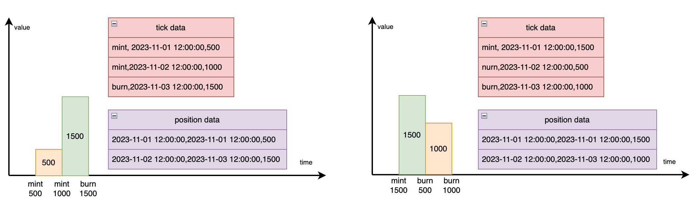

# Position Data

## Data generate principle


## Sample Data
```text
MINT, 2023-08-31 15:46:40, 446373730741895
MINT, 2023-08-31 15:48:34, 998405418734053
MINT, 2023-08-31 15:53:08, 231753972680681
BURN, 2023-08-31 19:16:55, -838266561078314
BURN, 2023-09-01 06:13:35, -838266561078315

position_address.csv
address,position,mint_dt,burn_dt,liquidity,lower_tick,upper_tick
0x271cbe9f871154b91150dd9a6b1c28b783a58e3c,1032437,2023-08-31 15:46:40,2023-08-31 15:48:34,446373730741895,201710,202230
0x271cbe9f871154b91150dd9a6b1c28b783a58e3c,1032437,2023-08-31 15:48:34,2023-08-31 15:53:08,1444779149475948,201710,202230
0x271cbe9f871154b91150dd9a6b1c28b783a58e3c,1032437,2023-08-31 15:53:08,2023-08-31 19:16:55,1676533122156629,201710,202230
0x271cbe9f871154b91150dd9a6b1c28b783a58e3c,1032437,2023-08-31 19:16:55,2023-09-01 06:13:35,838266561078315,201710,202230
```

## Data flow
```text
1. prepare tick/proxy csv data
2. update tick sender from proxy, if sender cannot find, the tick data will removed, because proxy data lack for some mint beyond the start time.
3. filter tick data by MINT/BURN, and (record length - 1) dt as **mint_dt**, and next record's dt as **burn_dt**, if sum(liquidity) <= 0 will stop, else add one position record without burn_dt.
```